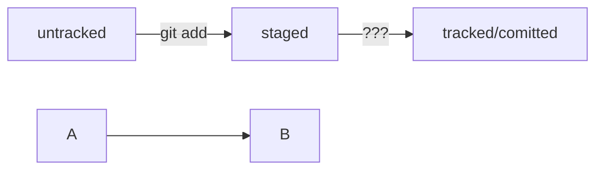

# Creation of my first git

## Initialize local git repository

1. Download and install Git for Windows
2. Create a repository:  
```bash
cd ~/Desktop && mkdir first && cd first
git init
```
3. Add readme:
```bash
touch readme.md
```
4. Add it to git and then commit:
```bash
git add .
git commit -m "Add readme.md"
```

## Initialize remote git repository at GitHub

1. Check if there any ssh keys exist already:  
```bash
ls -la ~/.ssh/
```
2. Now generate the key:  
```bash
ssh-keygen -t ed25519 -C
```
3. Copy the public key:  
```bash
clip < ~/.ssh/id_ed25519.pub
```
4. Add it to your github profile
5. Check if it works:  
```bash
ssh -T git@github.com
yes
```
6. Add repo to GitHub. Just create there new repo and get its SSH address  
```bash
git remote add origin git@github.com:fyefh5/first.git
```
7. Check if it works:  
```bash
git remote -v
```
8. push commit:
```bash
git push -u origin main
```
9. For next pushes just use   
```bash
git bush
```

## git log

1. There are hashes that identify each commit uniquely  
```bash
git log
```
2. 

HEAD -- это голова.
Коммит -- это всему голова.
Статусы файлов:
<тут пустая строка!>


<и тут пустая строка!> 